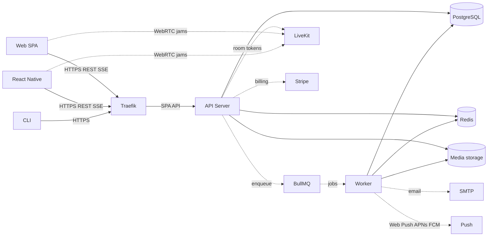
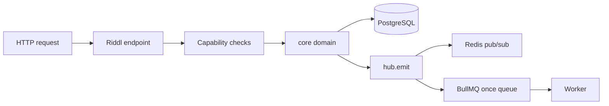
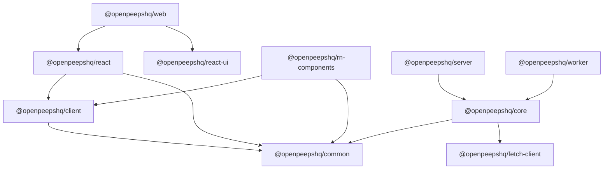

# OpenPeeps Architecture Diagram

OpenPeeps is a modular monolith: a React SPA and React Native clients talk to
one Express API. Shared domain logic lives in `@openpeepshq/core`. Background
work runs in a BullMQ worker. PostgreSQL is the source of truth; Redis is
cache, hub pub/sub, and the BullMQ broker.

Plugins load **in-process** in the API (routes, hub interceptors, UI
manifests). They are not a separate deployable.

Locally, clients call the API directly. Production puts Traefik (or another
reverse proxy) in front and serves the built SPA from the API process.

## Runtime

| Process | Package | Role |
| --- | --- | --- |
| API server | `@openpeepshq/server` | Riddl HTTP API, SSE, static SPA, plugin routes |
| Worker | `@openpeepshq/worker` | Email, media, notifications, jam egress, analytics |
| Web SPA | `@openpeepshq/web` | Vite React app; production assets hosted by the API |
| CLI | `@openpeepshq/cli` | Admin operations against the same API and database |

The worker boots from `platform/server/src/worker.ts` (registers email
templates, then `@openpeepshq/worker`). Docker `CMD` is `web` or `worker`.

## Request path

1. Client calls `/api/openpeeps/core/v1/…` via `@openpeepshq/client`.
2. The Riddl handler authenticates and checks role/resource capabilities.
3. Domain work runs in `@openpeepshq/core` (Drizzle / `pg/map`).
4. Side effects go through `hub.emit`: live Redis subscribers (`hub.on`) plus
   durable `hub.once` jobs on the worker.
5. Heavy work (email, media, push) is a dedicated BullMQ queue, not the
   request thread.

There is **no app-wide WebSocket**. Jams use LiveKit; short-lived progress
and session invalidation use SSE; offline alerts use push. See
[Realtime](/docs/development/architecture/realtime).

## Packages

Libraries (`@openpeepshq/core`, `client`, `common`, `react`, …) are not
processes. This is the deployable and library graph:

## Related

- [Architecture overview](/docs/development/architecture)
- [Backend](/docs/development/architecture/backend)
- [Frontend](/docs/development/architecture/frontend)
- [Realtime](/docs/development/architecture/realtime)
- [Data storage](/docs/development/data-storage)
- [Plugins](/docs/development/plugins)
