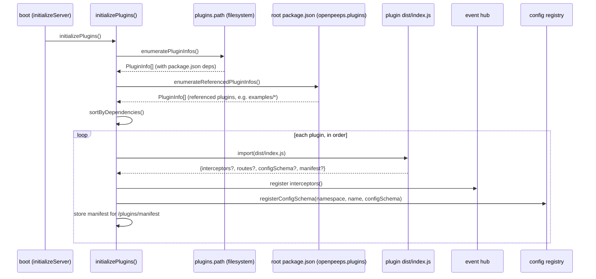
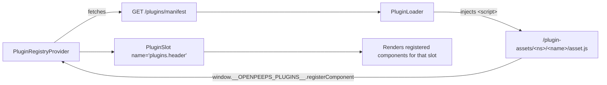

# Plugin System

> Implementation guide and contract for OpenPeeps plugins.

> **⚠️ Important — plugin removal in git does not remove it from a deployment.** > `plugins/<namespace>/<name>/` plugins are scanned from the **host**
> directory bind-mounted at `PLUGINS_PATH` in production, not from the git
> repo or the built image. Renaming, moving, or deleting a plugin in git
> does **not** remove it from that host directory — it's operator-managed
> and persists across deploys and image rebuilds. See "Troubleshooting" in
> §9 (Deployment) if a plugin keeps loading after you removed or renamed it.

---

## 1. How Plugins Work

OpenPeeps ships with a lightweight plugin loader that runs at boot time.

### Where it lives

| File                                        | Role                                                                                                                                                   |
| ------------------------------------------- | ------------------------------------------------------------------------------------------------------------------------------------------------------ |
| `platform/core/src/plugins/index.ts`        | Plugin loader (`initializePlugins`, `getPlugins`, `getPluginModule`, `getPluginManifests`)                                                             |
| `platform/core/src/plugins/helpers.ts`      | `enumeratePluginInfos` (filesystem scan), `enumerateReferencedPluginInfos` (root `package.json` refs), `sortByDependencies`                            |
| `platform/common/src/types/plugins.ts`      | `Plugin`, `PluginManifest`, `PluginInfo`, `PluginConfigResponse`                                                                                       |
| `platform/common/src/types/config.ts`       | Config schema for `plugins.path` and `plugins.rootPackageJsonPath`                                                                                     |
| `platform/core/src/config/defaults/core.ts` | Defaults for `plugins.path` (`PLUGINS_PATH` env or `../plugins`) and `plugins.rootPackageJsonPath` (`ROOT_PACKAGE_JSON_PATH` env or `../package.json`) |
| `platform/server/src/lib/plugins.ts`        | `buildPluginRouters`, `pluginAssetsMiddleware` (route mounting + static asset serving)                                                                 |

### Plugin Contract

A plugin is a folder with a `package.json` and a backend entry point `src/index.ts` that compiles to `dist/index.js`. There are two ways a plugin gets discovered:

1. **Filesystem-scanned:** a folder at `plugins/<namespace>/<name>/`. Any folder found under `config.plugins.path` is loaded automatically (see "Enable" below). In production this path is a host-mounted volume, not part of the deployed image or git checkout — see the warning above and §9.
2. **Referenced:** a folder anywhere else in the repo (e.g. `examples/<name>/`) that is **not** scanned automatically. It only loads when its path (relative to the repo root) is listed in the root `package.json`'s `openpeeps.plugins` array. These are keyed as `examples/<name>` and are the mechanism used for demo/example plugins that shouldn't ship enabled by default. See §7.

### Backend Exports

| Export         | Required | Purpose                                                                                       |
| -------------- | -------- | --------------------------------------------------------------------------------------------- |
| `interceptors` | No       | Map of `CoreEvents` handlers (`postCreated`, `profileCreated`, `jamRecordingCompleted`, etc.) |
| `routes`       | No       | Express `Router` factory — receives a fresh `Router` instance                                 |
| `configSchema` | No       | `{ schema: () => ZodSchema, defaults: object }` for admin config UI                           |
| `manifest`     | No       | Frontend component manifest (see §4)                                                          |

### Backend Loading

1. **Scan:** `initializePlugins()` reads `config.plugins.path` (default `path.join(base, '../plugins')`) and enumerates subdirectories matching `package.json`.
2. **Enable:** A scanned plugin is skipped unless its `package.json` contains `{ "openpeeps": { "enabled": true } }`. Omitting the field also enables the plugin; set `"enabled": false` to disable it without removing the folder.
3. **Referenced plugins:** Plugins outside `plugins/<namespace>/<name>/` are not scanned. `enumerateReferencedPluginInfos()` reads `config.plugins.rootPackageJsonPath` (default `path.join(base, '../package.json')`, env `ROOT_PACKAGE_JSON_PATH`) and loads the paths listed in that file's `openpeeps.plugins` array. There is no separate enable flag for these — presence in the array is the only gate.
4. **Sort:** All discovered plugins (scanned + referenced) are topologically sorted by `dependencies` declared in `package.json`. Cycles or unresolved dependencies are logged and dropped.
5. **Load:** Each plugin is dynamically imported via `import(\`${pluginPath}/dist/index.js\`)`.
6. **Hook:** If the module exports `interceptors()`, handlers are registered on the core event `hub`.
7. **Config:** If the module exports `configSchema`, it is registered via `registerConfigSchema(namespace, name, …)`.
8. **Manifest:** If the module exports `manifest`, it is stored and exposed by `GET /api/openpeeps/core/v1/plugins/manifest`.



### Current extension points

- **Event interceptors** — `profileCreated`, `postCreated`, `jamRecordingCompleted`, `followCreated`, `notificationCreated`, `reactionCreated`, `entryCreated`, `rsvpCreated`, `postAnnounced`, `configUpdated`.
- **Config schema registration** — plugins declare Zod schemas and defaults for their own settings, edited via the same admin UI as core configs.
- **API routes** — plugins export `routes(router)` and receive an Express `Router` mounted under `/api/openpeeps/core/v1/plugins/<namespace>/<name>`.
- **Frontend manifest** — plugins declare components that target named slots in the React UI.

### Current state

- Backend loader is production-ready for event interception, config extension, and API route extension.
- Frontend registry is implemented as a React context (`PluginRegistryProvider`) and loads plugin scripts from `/plugin-assets/<namespace>/<name>/...`.
- No plugins are enabled by default; the default `../plugins` directory is empty and the root `package.json`'s `openpeeps.plugins` array is empty unless a project opts a plugin in.
- Scanned plugins (`plugins/<namespace>/<name>/`) support an `{ "openpeeps": { "enabled": false } }` flag to disable without removing the folder; any folder found is otherwise loaded. Referenced plugins (`openpeeps.plugins` in the root `package.json`) have no separate enable flag — listing the path is the enable/disable switch.
- There is **no sandboxing** — plugins run in the same Node process with full access to `@openpeepshq/core` and the configured Express app.

---

## 2. API Endpoints

Core endpoints exposed for plugin discovery:

| Method | Path                                                  | Description                                                                      | Auth          |
| ------ | ----------------------------------------------------- | -------------------------------------------------------------------------------- | ------------- |
| `GET`  | `/api/openpeeps/core/v1/plugins`                      | Loaded plugin metadata (key, namespace, name, version, displayName, description) | None          |
| `GET`  | `/api/openpeeps/core/v1/plugins/config`               | Merged plugin config tree                                                        | Auth required |
| `GET`  | `/api/openpeeps/core/v1/plugins/manifest`             | Frontend component manifests per plugin                                          | None          |
| `any`  | `/api/openpeeps/core/v1/plugins/<namespace>/<name>/*` | Plugin-defined Express routes                                                    | _See §3_      |

The plugin's `routes(router)` function receives a fresh Express `Router` already scoped to `/api/openpeeps/core/v1/plugins/<namespace>/<name>`, so routes inside the plugin should use relative paths.

---

## 3. Plugin Routes and Security

**Important: Plugin routes are mounted as raw Express Routers before the Riddl catch-all.** This means they bypass Riddl's built-in authentication, authorization, and error-handling pipelines.

### Responsibility

Plugin authors **must** implement their own authentication and capability checks if routes require protection. Riddl's `ensureRoleCapabilities`, `ensureAccess`, and similar helpers are not available in plugin routes.

### Example: Auth-protected plugin route

```ts
import type { Router } from 'express';
import { ensurePluginAuth } from '@openpeepshq/core/plugins';

export const routes = async (router: Router) => {
  router.get('/secure-data', ensurePluginAuth(), async (req, res) => {
    // req.pluginProfile is set to { id: string } when the token is valid.
    // Note: this helper only verifies the JWT signature and the presence of a
    // profile identity. It does not expose the handle or check revocation.
    res.json({ data: 'secret', profile: req.pluginProfile });
  });
};
```

### Best Practices

1. **Default to authenticated:** If your plugin serves sensitive data, always require auth.
2. **Minimize exposed endpoints:** Only expose what plugins/app needs.
3. **Validate input:** Use Zod schemas in plugin route handlers.

---

## 4. Frontend Plugin System

The frontend uses a **slot-based registry**. Plugins ship plain JavaScript IIFE bundles that call `window.__OPENPEEPS_PLUGINS__.registerComponent(slot, key, Component)`.



### React API

| Symbol                   | Location                        | Purpose                                                                                           |
| ------------------------ | ------------------------------- | ------------------------------------------------------------------------------------------------- |
| `PluginRegistryProvider` | `@openpeepshq/react/components` | Context owning slot/component state; exposes `window.__OPENPEEPS_PLUGINS__`                       |
| `PluginLoader`           | `@openpeepshq/react/components` | Fetches manifest, injects `<script>` tags for each declared asset                                 |
| `PluginSlot`             | `@openpeepshq/react/components` | Renders all components registered for a named slot (function component, no class `ErrorBoundary`) |
| `usePluginRegistry`      | `@openpeepshq/react/components` | Direct access to `registerComponent` and `getComponentsForSlot`                                   |

### Usage example

```tsx
import { PluginSlot } from '@openpeepshq/react/components';

function SomePage() {
  return (
    <>
      <PluginSlot name="plugins.header" />
      <main>core content</main>
      <PluginSlot name="plugins.footer" />
    </>
  );
}
```

### Manifest Schema (Zod)

```ts
const pluginManifestSchema = z.object({
  components: z
    .array(
      z.object({
        slot: z.string(),
        asset: z.string(),
        componentKey: z.string(),
      }),
    )
    .default([]),
});
```

### Theming

Plugins should follow the host's community theme rather than hardcode colors, so
they stay readable when an admin changes the primary/secondary color or switches
light/dark. There are two ways to do this, and they're complementary:

1. **CSS custom properties.** `libraries/react-ui/src/styles/globals.css` defines
   the color tokens on `:root` / `[data-theme='OpenpeepsLight'|'OpenpeepsDark']`.
   The ones a plugin can rely on (host-wide, not plugin-internal) are:

   | Variable                       | Meaning                                                                       |
   | ------------------------------ | ----------------------------------------------------------------------------- |
   | `--color-primary`              | Community's configured primary/brand color                                    |
   | `--color-primary-foreground`   | Text/icon color that reads on `--color-primary`                               |
   | `--color-secondary`            | Community's configured secondary color (falls back to a default if unset)     |
   | `--color-secondary-foreground` | Text/icon color that reads on `--color-secondary`                             |
   | `--color-surface`              | Neutral panel/card background (not admin-configurable, but tracks light/dark) |

   **Important:** the values are stored as space-separated RGB channels (e.g.
   `--color-primary: 12 144 167;`), not hex and not a full `rgb(...)` string. Use
   them with the `rgb()` function: `rgb(var(--color-primary) / 0.5)` for 50%
   opacity, or `rgb(var(--color-primary))` for solid. A plugin's own stylesheet
   (see the Tailwind caveat below) can reference these directly — they're set on
   `document.body`, so any element inside the app picks them up by inheritance.

2. **`window.__OPENPEEPS_THEME__` for plugin JS.** For plugin code that builds
   inline styles (like `web/greeter.js` in the example plugin) rather than
   shipping a stylesheet, the host resolves the same tokens to ready-to-use
   `rgb(...)` strings and publishes them on `window` once the theme is applied:

   ```js
   window.__OPENPEEPS_THEME__ = {
     primary: 'rgb(12 144 167)',
     primaryForeground: 'rgb(255 255 255)',
     secondary: 'rgb(...)', // only set if the community configured one
     secondaryForeground: 'rgb(...)', // only set alongside `secondary`
     surface: 'rgb(244 244 245)',
   };
   ```

   Read it defensively — it may be `undefined` on older hosts, and individual
   keys may be missing (e.g. `secondary` when the community hasn't set one):

   ```js
   const theme = window.__OPENPEEPS_THEME__ || {};
   const primary = theme.primary || '#2563eb'; // sensible hardcoded fallback
   ```

   The global is set by `OpenpeepsThemeProvider`
   (`platform/react/src/components/layout/OpenpeepsThemeProvider.tsx`) right
   after it injects the theme override `<style>` tag, so it reflects the
   current community theme and the signed-in profile's light/dark preference.
   It is **not** reactive — if the admin changes the theme while the page is
   open, plugin components that read it once won't update until next reload,
   same as any other value read off `window` at mount time.

---

## 5. Plugin Frontend Bundles

Plugin bundles are served from `/plugin-assets/<namespace>/<name>/<asset>` and should use the global `window.React` object exposed by `PluginRegistryProvider`.

```js
// plugins/<namespace>/<name>/web/widget.js
const Widget = () => React.createElement('div', null, 'Hello!');
window.__OPENPEEPS_PLUGINS__.registerComponent(
  'plugins.header',
  'my-ns/my-plugin/widget',
  Widget,
);
```

### Build Contract (IMPORTANT)

1. **React must be external.** Plugin builds must declare `react` and `react-dom` as `peerDependencies` or `external`. Bundling your own React instance causes "Invalid Hook Call" errors.
2. **Target `esm` or `iife` for `web/` bundles.** The `dist/index.js` backend entry uses ESM; frontend bundles use IIFE.
3. **Asset naming must match manifest.** The `asset` field in the manifest must exactly match the filename in your `web/` directory.
4. **Do not rely on the host Tailwind classes.** The host app's Tailwind build only scans its own source tree, so utility classes used exclusively inside a plugin bundle (e.g. `bg-primary/10`) are not guaranteed to exist in the final CSS. Ship your own stylesheet or use inline styles for reliable styling.

### Example Plugin Build (Vite)

```ts
// plugins/my-ns/my-plugin/vite.config.ts
import { defineConfig } from 'vite';

export default defineConfig({
  build: {
    lib: {
      entry: 'src/index.ts',
      formats: ['es'],
      fileName: 'index',
    },
    rollupOptions: {
      external: ['react', 'react-dom', '@openpeepshq/core'],
    },
  },
});
```

---

## 6. Plugin Static Assets

Server serves plugin frontend assets at:

```
GET /plugin-assets/<namespace>/<name>/<path>
```

This is configured via `pluginAssetsMiddleware()` in `platform/server/src/lib/plugins.ts`, mounted in `platform/server/src/server.ts`. Only paths under `web/` are servable; the middleware parses `req.path` (not raw regex params) to resolve the plugin's namespace/name/asset, resolves the plugin's root from the loaded `Plugin.path` (not by recomputing it from `plugins.path`, so referenced plugins under `examples/` resolve correctly too), resolves symlinks with `fs.realpathSync`, and rejects anything that escapes the plugin's own directory. Path traversal returns `403 Forbidden`.

---

## 7. Example Plugin

A working example lives at `examples/greeter-plugin/`, built as a fully standalone node module (`@openpeepshq-examples/greeter-plugin`):

- `src/index.ts` — backend entry with `interceptors`, `routes`, `configSchema`, `manifest`
- `web/greeter.js` — frontend IIFE bundle
- `package.json` — declares `@openpeepshq/core` and `@openpeepshq/common` as dependencies

Build: `pnpm --filter @openpeepshq-examples/greeter-plugin build`

The example demonstrates:

1. An interceptor on `postCreated`.
2. A custom Express route `GET /api/openpeeps/core/v1/plugins/examples/greeter-plugin/hello`.
3. A dynamic config schema (`greeting`).
4. A frontend manifest for the slot `plugins.header`.
5. A global-React frontend bundle that renders a banner in `/plugins` via `PluginSlot`.

Unlike `plugins/<namespace>/<name>/`, folders under `examples/` are **not** scanned automatically. It only loads when the root `package.json` references it:

```json
"openpeeps": {
  "plugins": ["examples/greeter-plugin"]
}
```

**It ships disabled by default** — the root `package.json`'s `openpeeps.plugins` array is empty. To try the example, add `"examples/greeter-plugin"` to that array as shown above, then run `pnpm --filter @openpeepshq-examples/greeter-plugin build` (and restart the server if it's already running). Remove the entry again (or empty the whole array) to disable it. This makes `examples/` a safe place for demo/reference plugins that ship in the repo but stay off by default — contrast with `plugins/<namespace>/<name>/`, where any folder present is loaded unless explicitly disabled.

The `Dockerfile` builds plugins via the `plugins/*/*` glob rather than a hardcoded plugin name, so any plugin dropped under `plugins/<namespace>/<name>/` is picked up by the production build. Plugins referenced from `examples/` are opt-in and are not built by that glob; build them explicitly (e.g. via their own `pnpm --filter` target) if you want to ship one.

---

## 8. Open Decisions

1. **No sandboxing.** Plugins run in the same Node process with full access to `@openpeepshq/core` and the Express app. Plugin installation = server code execution.
2. **No signing/validating manifests.** `pluginManifestSchema.parse()` validates structure; semantic trust of manifest content is the server operator's responsibility.
3. **No npm registry.** Plugins are installed manually as subdirectories.
4. **Plugin distribution format:** Currently plain folders with compiled `dist/index.js`. npm packages remain possible.
5. **Plugin versioning & updates:** Use `package.json` dependencies/peerDependencies. Core API changes are not version-gated yet.
6. **Frontend module loading:** Implemented as simple `<script>` injection of plugin bundles. Native ESM / import maps may replace this in the future.
7. **Plugin marketplace / discovery:** Out of scope; plugins are installed manually.
8. **Plugin enumeration is public.** `GET /plugins` and `GET /plugins/manifest` return plugin names, versions, and manifest metadata without authentication. This is considered acceptable metadata disclosure, but operators should be aware that plugin names/versions may leak implementation details.

## 9. Deployment

The example Traefik stack (`traefik/docker-compose.yml`) loads plugins from a
volume-mounted directory (`../plugins:/apat/plugins`). The mounted tree must be
a built workspace: each plugin needs its own `node_modules` (so pnpm workspace
symlinks resolve) and a compiled `dist/index.js`. Before starting the stack:

```sh
pnpm install
pnpm -r --filter "*plugins*" build
```

Then start the stack:

```sh
cd traefik
cp .env.example .env
# edit .env and set SERVICE_DOMAIN
docker compose up -d --build
```

The `Dockerfile` also sets `ROOT_PACKAGE_JSON_PATH=/apat/package.json` alongside
`PLUGINS_PATH=/apat/plugins`, so referenced plugins (§7) resolve correctly in
this image without extra configuration — the loader reads the same root
`package.json` that was baked into the image at build time.

### Troubleshooting: a removed/renamed plugin keeps loading

`plugins/<namespace>/<name>/` is scanned from the **host** directory bind-mounted
at `PLUGINS_PATH` (`../plugins:/apat/plugins` in the Traefik stack), not from
the application image. Renaming or deleting a plugin in git has no effect on
that host directory — it's operator-managed and persists across deploys and
image rebuilds.

If a plugin you removed or renamed in the repo still appears to be loaded
after deploying:

1. Check what the server thinks is loaded: `GET /api/openpeeps/core/v1/plugins`.
2. Inspect the host directory mounted at `PLUGINS_PATH` (or `docker compose exec <service> find /apat/plugins`) for the old `<namespace>/<name>/` folder.
3. Delete the stale folder from the host and restart the container. Deleting it from the git repo alone is not enough — it must also be removed from wherever the plugin volume is mounted from.
